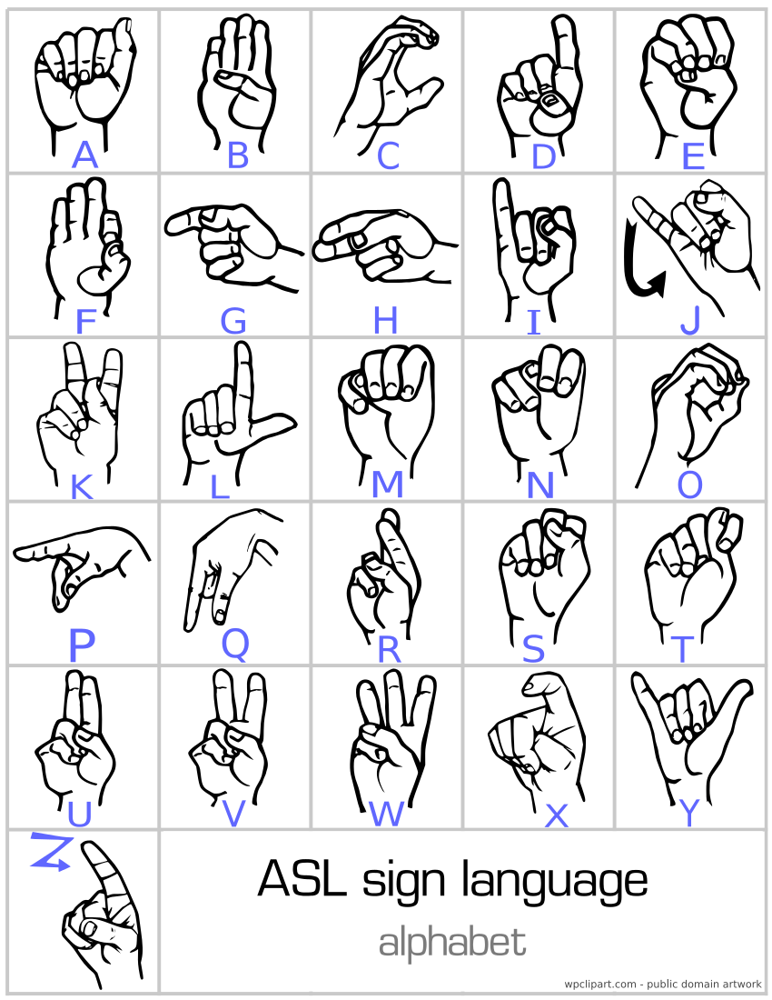
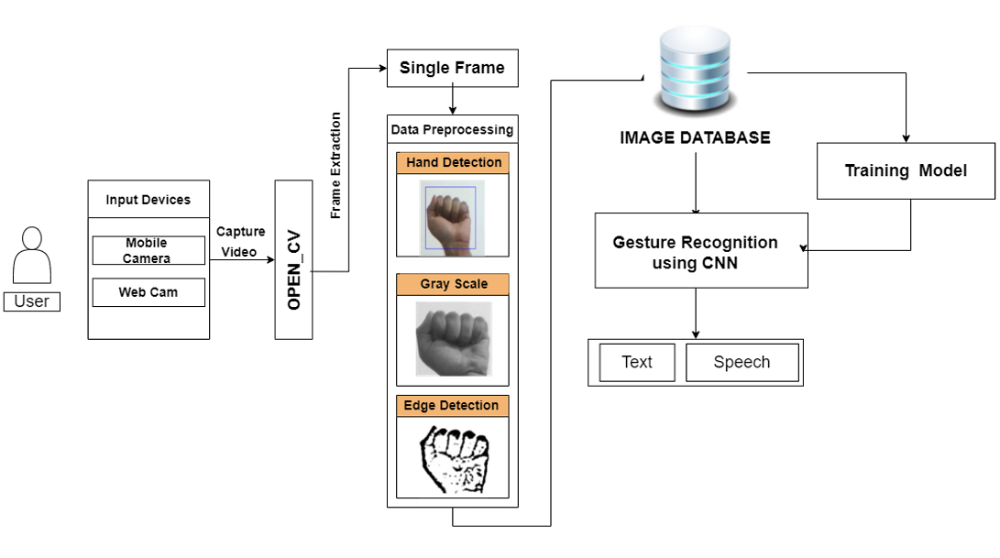

# Sign Language Recognition System
## Introduction

### Sign language is a type of language that uses manual communication to convey meaningful messages to other people. This includes simultaneous employing of hand gestures, movement, orientation of the fingers, arms or body, and facial expressions to convey a speaker's ideas.

### American Sign Language (ASL) is a complete, natural language that has the same linguistic properties as spoken languages, with grammar that differs from English. ASL is expressed by movements of the hands and face. 

### A real-time sign language translator is required for facilitating communication between the deaf community and the general public. We designed and created CNN (Convolutional Neural Network) model for hand image & pattern recognition. This model recognize 27 symbols(A-Z, blank) of American Sign Language.

### We have created Web Application for translation of American Sign Language with the help of Deep Learning algorithm which can accurately identify and classify [A-Z] ASL characters. Identified characters are shown on screen in text format.

### Software Used - 
- Language: Python
- Libraries: 
    - OpenCV-python
    - Pandas
    - streamlit
    - NumPy
    - streamlit-webrtc
    - mediapipe
    - tensorflow

### System Architecture:

### Team Strucutre:
### - Aditya Pise: Literature Survey, Dataset Creation, CNN Model creation, Documentation
- Suraj Gawade: Literature Survey, Dataset Creation, CNN Model Creation, 
Documentation 
- Saurabh Kumatkar: Literature Survey, Dataset Creation, Web Application 
Creation, Documentation 
- Geet Lakhe: Literature Survey, Dataset Creation, Web Application Creation, 
Documentation 
 